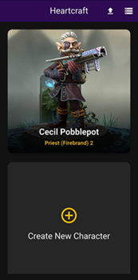
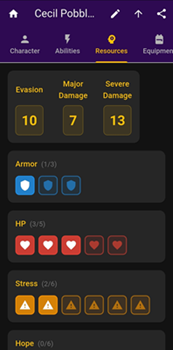
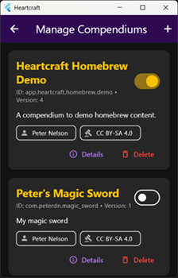

# Heartcraft

Heartcraft is a cross-platform Daggerheart-compatible character creator and manager. Designed for
use on mobile, tablet, and desktop devices, it runs entirely locally: no internet or network access
required. It is highly extensible, supporting homebrew content as a first-class feature through
importable "compendiums" containing user-provided game data.

> **⚠️ Content Disclaimer**
>
> The Darrington Press Community Gaming License (DPCGL) currently explicitly prohibits non-print
> digital distribution of SRD game content. Therefore, Heartcraft does not include any Daggerheart
> SRD or official game data. Users must supply their own content or homebrew compendiums.
> Distribution of ANY copyrighted material through this app, whether under the DPCGL or otherwise,
> is strictly prohibited without the express permission of the copyright owner.

## Features

Currently in **early alpha**, Heartcraft supports the following high-level features:

- Create characters with a step-by-step wizard
- Import and export characters to/from local files
- Track character stats, abilities, resources, equipment, inventory, and gold
- Level-up characters (ℹ️ currently capped to tier 2 / level 4)
- Import and manage compendiums of user-provided game data
- Manage character-specific custom weapons and armor
- Cross-platform - so far tested on:
  - Windows 11
  - Android 7 (Samsung Galaxy Tab S2)
  - Android 15 (Samsung Galaxy S21)
  - Linux (Ubuntu 24.04 LTS)

> ℹ️ A [sample homebrew compendium](app/assets/data/app.heartcraft.homebrew.demo.xml) is included
> to showcase these features. Note that this compendium is not balanced nor playtested for actual
> gameplay, but feel free to use or extend it as you like.

### Screenshot Gallery

[](docs/images/screenshot-phone-home-screen.jpg)
[](docs/images/screenshot-phone-resources-tab.jpg)
[](docs/images/screenshot-windows-compendiums.png)

## Download

Binary releases for Android and Windows x64 can be found under
[GitHub Releases](https://github.com/peterdn/heartcraft/releases).

> ⚠️⚠️⚠️ Please note that these binaries are unsigned and may require bypassing security settings
> to install (particularly on Android). This is generally NOT a good idea so proceed at your own
> risk.

---

## Design Philosophy

Aspirational (it's nowhere near there yet!) app tenets include:

- **Powerful and customisable, with sensible defaults**: Heartcraft should give power to players
  who want it, while keeping things simple for those who don't. For example, if a player equips new
  armour, damage thresholds should automatically update accordingly. If they want to manually
  adjust them back, they should be able to.
- **Explainable**: Heartcraft should provide an explanation for why something is the way it is. For
  example, a player should be able to see how their damage thresholds were calculated, i.e. how
  armour and manual adjustments both contributed.
- **Extensible, homebrew-first**: every game table has _some_ homebrew. Heartcraft should be able
  to represent and allow players to use it.
- **Multi-platform support**: Heartcraft should be usable and beautiful on any display size, on
  any device, across all supported operating systems.
- **Free and private**: Heartcraft is licensed under the copyleft GNU AGPL, so improvements and
  contributions can always be shared with the community. The app is designed to run entirely
  locally on your personal devices and will not include ads.

## Roadmap

It's early days for Heartcraft and, as a hobby project, features are prioritised based on what I
need at my own game table. Upcoming TODOs include:

- [ ] Finish level-up, i.e. support tier 3 and 4 advancements, including multiclassing
- [ ] Domain card vault
- [ ] Inventory weapons
- [ ] Support for large, tier-dependent features (e.g. like Druid Beastform)
- [ ] Ability resource/token management (e.g. Prayer dice tracker)
- [ ] ... general UI and UX improvements across the board (currently prioritises "function over form")!
  - [ ] Inventory and gold management specifically need love
  - [ ] App icons
- [ ] iOS & MacOS support (may already work, but I currently do not have the tools or hardware to build
      or test for these platforms)
- [ ] Character syncing between devices?
  - Would break the "free and private" design philosophy...

## Contributing

See [CONTRIBUTING.md](CONTRIBUTING.md) for project contribution guidelines (under construction).

Specific help would be very much appreciated in the following areas:

1. Artwork (e.g. app icon, splash screen)
2. UI / UX design
3. An "official" Heartcraft homebrew compendium that is balanced and playtested would be cool! To
   give a more complete "batteries-included" experience.
4. General feedback!

## Getting Started

Heartcraft is built using Flutter and Dart.

### Prerequisites

- Flutter SDK
- Android SDK (for Android builds)
- Windows development environment (for Windows builds)

### Building and Running

1. Clone this repository
2. `cd app`
3. Run `flutter pub get` to install dependencies
4. Run `flutter run` to start the app in debug mode

### Packaging for Android

To build an Android APK:

```bash
cd app
flutter build apk --release --build-name=$(cat ../VERSION) --build-number=$(git rev-parse --short HEAD)
```

### Packaging for Windows

To build a Windows executable:

```bash
cd app
flutter build windows --release --build-name=$(cat ../VERSION) --build-number=$(git rev-parse --short HEAD)
```

Note that this executable is not standalone, it requires:

- All of the auxiliary .dlls and assets found under `build\windows\x64\runner\Release`
- [Visual C++ 14 runtime libraries](https://learn.microsoft.com/en-us/cpp/windows/latest-supported-vc-redist?view=msvc-170#latest-supported-redistributable-version), specifically:
  - msvcp140.dll
  - vcruntime140.dll
  - vcruntime140_1.dll

Currently this is all just packaged into a zip archive - no Windows installer for Heartcraft is provided.

## Compendium Data Format

An example compendium is included in the `app/assets/data` directory: [app.heartcraft.homebrew.demo.xml](app/assets/data/app.heartcraft.homebrew.demo.xml)

**TODO**: Compendium XML specification and documentation.

## License

Heartcraft is licensed under the GNU AGPL. See [LICENSE](LICENSE) for full details.
